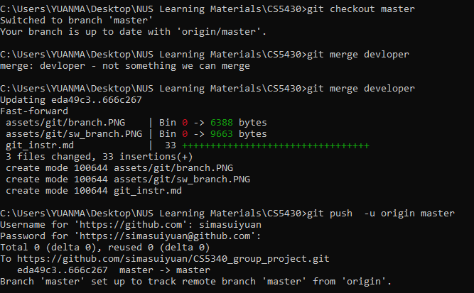

# git instructions

# Initial setup

## clone repository
```
git clone https://github.com/simasuiyuan/CS5340_group_project.git
cd CS5340_group_project
```
## check branch
```
git branch -a
```

## switch branch to developer
```
git checkout developer
git branch 
```


# pull works
```
git pull origin developer
```
## upload works
```
git add $"files or folder to be uploaded"
```
* e.g: ```git add BN_Structure_Learning```
```
git commit -m "commit message"
```
* e.g: ```git commit -m "BN_Structure_Learning first uploads"```
```
git push -u origin developer
```

### <span style="background-color: #FFFF00"> Note: if you not sure about the work under developer, dont merge! Or let one person handle this after we discuss and confirm the code</span>
## merge to master (better manage by one person)
```
git checkout master
git merge developer
git push  -u origin master
```
