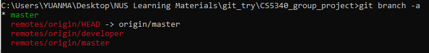
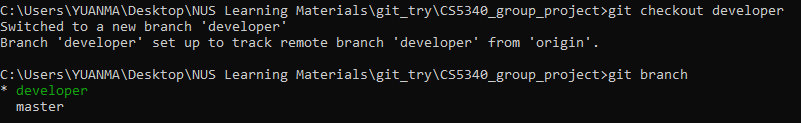

# git instructions

# Initial setup

## clone reposity
```
git clone https://github.com/simasuiyuan/CS5340_group_project.git
cd CS5340_group_project
```
## check branch
```
git branch -a
```

## switch branch to developer
```
git checkout developer
git branch 
```


## upload works
```
git add $"files or folder to be uploaed"
```
* e.g: ```git add BN_Structure_Learning```
```
git commit -m "commit message"
```
* e.g: ```git commit -m "BN_Structure_Learning first uploads"```
```
git push -u origin developer
```
